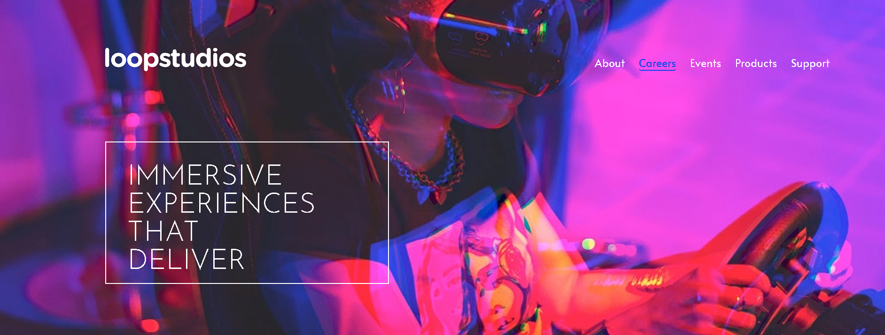

# LoopStudios
Uma landing page para uma empresa fictícia chamada Loopstudios.

## DETALHES DO PROJETO:
O objetivo deste projeto foi criar uma página para uma empresa de tecnologia.
Com um menu hamburger no projeto para mobile.

## Disponível para desktop e mobile!
Este projeto foi desenvolvido com responsividade conseguindo se adequar tanto para telas
de mobile quanto para telas desktop.

## Foto do Projeto

## Link para o projeto pronto:
Confira o projeto completo no link abaixo: 
https://williamfischdick.github.io/Loopstudios/

## TECNOLOGIAS USADAS NO PROJETO:
* HTML
* CSS
* JavaScript
